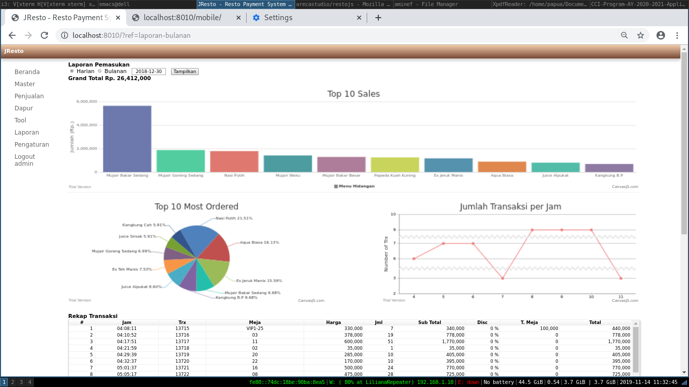

# RestoJs 3.0

## Description
This application is an updated version to replace an old one I built several years ago. There is some upgrading functions or features for each modules which modified to give the user some more abilities to control and maintain the data for some proper informations.

## Preview

## TODO
### Task(s) started on August 17, 2019
- [x] Create two queries for taxes-report
- [ ] Firs for the old report with misleaded formula
- [ ] Last for the new report with corrected formula
- [ ] Discuss with the client about monthly loss by this issue
- [ ] Deciede the cut-off date to fix this issue
